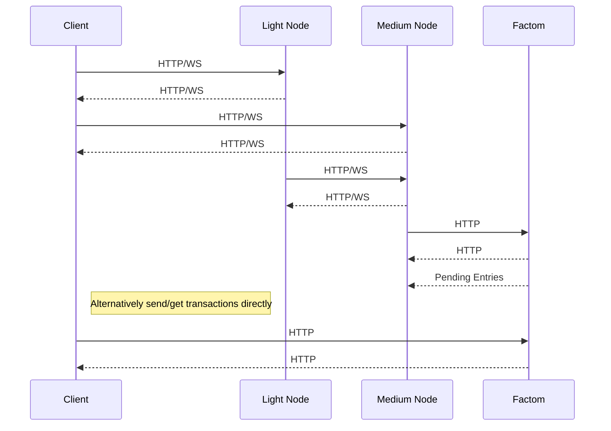

| FATIP | Title                   | Status | Category       | Author                             | Created   |
| ----- | ----------------------- | ------ | -------------- | ---------------------------------- | --------- |
| 0     | Fungible Token Standard | Draft  | Token Standard | Devon Katz \<<devonk@dbgrow.com>\> | 7-23-2018 |


[TOC]

# Summary

This document describes the functionality, datastructures, validation rules of the **FAT-0** token standard: A fungible data only token standard built on Factom chains and entries. It's functionality is most alike the ERC-20 token standard of Ethereum.


# Motivation

Create a decentralized, open token standard on top of the Factom protocol. The FAT-0 standard allows issuance and trade tokenized assets between Factoid addresses.

Following the Factom ethos, FAT standards are data-only protocols, and can be implemented on any system that supports immutable ordered data.

FAT-0 fills a critical gap between Colored Coins (BTC) and ERC (Ethereum) tokens. Implementation of the FAT-0 standard on Factom results in an immutable, fixed cost token system that is inexpensive to build, issue, and transfer tokens on:

- $0.02 USD to issue a new FAT-0 token
  - Additional $0.001 USD/KB of optional user defined content up to 10KB
- $0.002 USD to transact an unlimited number of tokens
  - Additional $0.001 USD/KB of optional user defined content up to 10KB

Because the standard supports arbitrary user defined data, it offers a base for more complex user defined behavior based on the underlying data. Custom token systems may be built on top of the basic functionality of this standard.


Applications include ICOs, digital currencies, digital goods, and accounting.


# Specification


## Token ID  `extends` [FAT-100](100.md)

An ID string universally unique to Factom identifies each token. This ID is the only piece of data needed to retrieve the token's data from Factom. It should be something short and memorable related to your token. For example: `mytoken` is the token ID of the FAT-0 test token: My Token (MYT).


## Addresses

FAT-0 uses Factom's [Factoid Address](https://www.factom.com/devs/docs/guide/factom-data-structures) key pairs based on ed25519 cryptography to send and receive tokens.


### Reserved Coinbase & Burn Address

The 0th Factoid Address: `FA1y5ZGuHSLmf2TqNf6hVMkPiNGyQpQDTFJvDLRkKQaoPo4bmbgu` representing a private key with all zeros is a reserved address for minting and burning tokens.

Only coinbase transactions are allowed from this address, which must ea be signed by the identity of the token issuer. Tokens sent to this address are provably un-spendable (burnt). This address is not allowed to send tokens from its balance under any circumstance.


## Token Issuance Chain

A Factom chain is used to hold data about the token's issuance.

 

### Issuance Chain ID `extends` [FATIP-100](100.md)

The issuance Chain ID can be calculated by the Token ID. It is calculated as such:

```
Chain ID = sha256(sha256(<Token ID>))
```

For example, for FAT-0 token `mytoken`:

```
Chain ID = sha256(sha256("mytoken"))
Chain ID = efeb6db82bf222a87c1fc756e09197ed6ac7672641761a019c26530967f27744
```


### Token Issuance Entry `extends` [FATIP-101](101.md)

A datastructure called the Token Issuance holds the information about the FAT-0 token such as it's name, symbol, supply, and ID. 

The issuance entry is the content of the first entry on the token's issuance chain. There is only one issuance entry per FAT-0 token (the first entry). 


#### Issuance Entry Content Example

```json
{
  "type": "FAT-0",
  "issuer": "888888dd9e60c1f0216f753caf5c9b5be4c9ca69db27a6c33d30dce3fe5ee709",
  "supply": 10000000,
  "name": "Example Token",
  "symbol": "EXT",
 
   "salt": "874220a808090fb736f345dd5d67ac26eab94c9c9f51b708b05cdc4d42f65aae",
  "idNonce": "cc4fee39dcdcfc1999ab07689230321acdd83fcd0ace521107041ef354b9cfb5",
  "idSignature": "33467893a440561d96ae27798dc8be291e1ce264d3c6f36f33a0d983e745f1d87db61c77946fe57db3e185f548d51da85106dfec592383a556091dd45f384b0c"
}
```


#### Issuance Entry Field Summary & Validation

| Name        | Type   | Description                                                  | Validation                                             | Required |
| ----------- | ------ | ------------------------------------------------------------ | ------------------------------------------------------ | -------- |
| type        | string | The type of this token issuance                              | Must equal 'FAT-0'                                     | Y        |
| issuer      | string | The Root Chain ID of the Issuing Identity                    | Identity must exist                                    | Y        |
| supply      | number | The maximum possible number tokens that can be in circulation. -1 means unlimited | Must be -1 (inf), or greater than 0                    | Y        |
|             |        |                                                              |                                                        |          |
| name        | string | The display name of the token                                | none                                                   | N        |
| symbol      | string | The display symbol of the token                              | must be A-Z, and 1-4 characters in length              | N        |
|             |        |                                                              |                                                        |          |
| salt        | string | Random string to be hashed into nonce                        | user defined. Optional                                 | Y        |
| idNonce     | string | a hash of the token information                              | sha256d(tokenID + salt). 256 bytes                     | Y        |
| idSignature | string | ed25519 signature from issuing identity's SK1 key            | ed25519 signature validation (idKey, nonce, signature) | Y        |


## Token Transaction Chain

A Factom chain is used to hold the transactions of the token's issuance. This allows time series locking of transactions, a requirement for validation.


### Transaction Chain ID `extends` [FATIP-100](100.md)

The transaction Chain ID can be calculated by the Token ID. It is calculated as such:

```
Chain ID = sha256(sha256(<Token ID>+":transactions"))
```

For example, for token `mytoken`:

```
sha256(sha256("mytoken:transactions")) = 965e285857be0176da28e56da4861550e2801ebd389209f319f43a0853000e00
```


### Token Transaction Entry `extends`* [FATIP-101](101.md)

Token Transaction Entries represent the signed transfer of an amount FAT-0 tokens from one Factoid address to another.

Transaction entries are the content of the entries on the token's transaction chain. The order of transaction entries represents a time ordered, locked record of submission for each transaction in Factom from oldest to newest.

FAT-0 Transactions borrow cryptographic elements from Factoid Transaction, including it's RCD(Redeem Condition Datastructure), and signatures. Each FAT-0 Transaction represents a single input single output transaction(Single RCD) instead of the multi-RCD structure of existing Factoid transactions.


#### Transaction Entry Content Example

```json
{
  "input": {
    "address": "FA1zT4aFpEvcnPqPCigB3fvGu4Q4mTXY22iiuV69DqE1pNhdF2MC",
    "rcdHash": "031cce24bcc43b596af105167de2c03603c20ada3314a7cfb47befcad4883e6f",
    "amount": 100
  },
  "output": {
    "address": "FA3aECpw3gEZ7CMQvRNxEtKBGKAos3922oqYLcHQ9NqXHudC6YBM",
    "rcdHash": "d381a44afa76ad5ab8f0d82adb27d6ffa031302cc3bb281c86b1b3dfabde395e",
    "amount": 100
  },
  "rcd": "013b6a27bcceb6a42d62a3a8d02a6f0d73653215771de243a63ac048a18b59da29",
  "nonce": 49135180951272,
  "marshalBinarySig": "022cb02d01aee801010064031cce24bcc43b596af105167de2c03603c20ada3314a7cfb47befcad4883e6f64d381a44afa76ad5ab8f0d82adb27d6ffa031302cc3bb281c86b1b3dfabde395e",
  "signature": "f8ff01d0a2d70c148036c97309a25aa5f29a4f6320c6471472fb2be30aef17bd77b95561714c84bd37932f41283debd02c197d51235212898ebf0cfd94939003",

  //coinbase TX fields
  "salt": "80d87a8bd5cf2a3eca9037c2229f3701eed29360caa975531ef5fe476b1b70b5",
  "idNonce": "96597acddfa91f58d5e20677063fedcb50dc32698f4b3f2dc2d89ea431f76b0b",
  "idSignature": "e391d3dae910ed09cc738f880fac5d573577fdc929d58b059dc4070f6007a3f16084e3d8de1a93a6a894dc7f1261eaaad1e67e3b2b94c6f2aeba64a87b378803"
}

```


#### Transaction Field Summary & Validation

| Name                | Type   | Description                                                  | Validation                                                 | Required |
| ------------------- | ------ | ------------------------------------------------------------ | ---------------------------------------------------------- | -------- |
| input               | object | The input parameters of this tx                              |                                                            | Y        |
| input.address       | string | The Factoid address to send tokens from                      | Valid public Factoid address                               | Y        |
| input.rcdHash       | string | Redeem condition hash of the input address & Amount          | sha256d validation                                         | Y        |
| input.amount        | number | amount of tokens to send                                     | Number \>0 and 10 or less decimal places                   | Y        |
|                     |        |                                                              |                                                            |          |
| output              | object | The output parameters of this tx                             |                                                            | Y        |
| output.address      | string | The Factoid address to send tokens from                      | Valid public Factoid address                               | Y        |
| output.rcdHash      | string | Redeem condition hash of the output address                  | sha256d validation                                         | Y        |
| output.amount       | number | amount of tokens to send                                     | must match input.amount                                    | Y        |
|                     |        |                                                              |                                                            |          |
| nonce               | number | Random numeric nonce. Used in place of timestamp in Factoid transaction since this cannot enforced by federated servers in our case | Integer with at least 1 digit                              | Y        |
| rcd                 | string | RCD of the input and output                                  | Factoid Transaction Validation                             | Y        |
| marshalledBinarySig | string | Marshalled binary signature of the Factoid Transaction       | Factoid Transaction Validation                             | Y        |
| signature           | string | ed25519 signature of the transaction                         | Factoid Transaction Validation                             | Y        |
|                     |        |                                                              |                                                            |          |
| salt                | string | Random bytes to be hashed into nonce                         | User defined, optional                                     | N*       |
| idNonce             | string | a hash of the transaction information                        | sha256d(tokenID + salt)                                    | N*       |
| idSignature         | string | ed25519 signature from issuing identity's SK1 key            | ed25519 signature validation (idKey, idNonce, idSignature) | N*       |

**\* = required for coinbase transaction**


#### Contextual Tansaction Validation	

Tansactions must be validated in context of their order within the transaction history to applied to an address's balance. Transactions must meet all of the following criteria to be valid:


- Must meet and pass all applicable validation criteria specified in the above table
- `signature` may not be reused for any transaction
- **IF**: The transaction is a coinbase transaction (From `FA1y5ZGuHSLmf2TqNf6hVMkPiNGyQpQDTFJvDLRkKQaoPo4bmbgu`):
  - `idSignature` may not be reused for any issuance (`issuance.signature`) or coinbase transaction
  - Issuing `input.amount` must not push the circulating supply of the token over it's maximum (`issuance.supply`). If the supply is unlimited, this is ignored.

- **ELSE IF**: The transaction is a normal transaction:
  - The current balance of `input.address` must be sufficient to cover `input.amount` 


Assuming these criteria are met,  `input.amount` is deducted from `input.address` and credited to `output.address`. In the case of a coinbase transaction, the deduction does not occur for `input.address`. 

This filtering and balance application process is repeated for all transactions in chronological order to reach the current state of the token.


# Implementation

Overall the the FAT-0 standard on Factom lends itself to being cross platform. Any client capable of executing HTTP requests to a local or remote Factom full node should be able to implement the standard.

Due to the specific storage and validation aspects of the standard and Factom's functionality, there are some implementation guidelines recommended. 


## Key-Value Storage

For efficiency it is required to store large quantities of key:value data representing mappings of:

-  Tranxsaction entry hashes **=>** transaction objects
- Transaction indexes(natural order) **=>** transaction entry hashes
- Factoid address **=>** token balances

A high performance external key value store like Redis would be ideal for such purposes. If an external database is not available then a local LevelDB or Sqlite database would suffice. It's important to defer storage to the disk instead of memory, as a successful token will have an ever increasing ordered list of transactions.


## Filtering

It's required to check for and detect duplicate signatures for FAT-0 transactions and issuances. Iteration and search over the entire array of transactions is infeasible due to scaling requirements. Probabilistic datastructures such as Bloom Filters offer a space efficient and scalable solution to this issue with a tunable false-positive rate.

### Bloom Filter Implementation

Bloom filters take in parameters to tune their size and false-positive rate.

- **n** - The number of items in the filter
- **p** - The target false positive rate
- **k** - The number of hash functions to act as buckets

Applying these parameters to an estimation function results in **m**, the total size of the filter in bits.


For the purposes of FAT-0, the following parameters are recommended:

- **p** - 1 / 1,000,000,000 (1.0E-9)
- **k** - 29.89

At a **n** of 1M signatures this results in a **m** of ~5.2 MB, which is acceptable when we compare it with the overhead of the alternative. At an **n** of 1,000,000 the equivalent array/map datastructure would consume ~128 MB not including iteration overhead which does not scale linearly. Here is a visualization of how the proposed bloom filter implementation scales:


As the number of transactions increases infinitely, it is possible to readjust the parameters of the filter to reach an acceptable false positive rate. This however requires a rebuild of the filter from the transaction database, and also opens up the possibility of forking. To put the scale required for this redefinition in perspective, Bitcoin currently has around 333M confirmed transactions compared to our theoretical **n** of 1M.

With good will and proper salting it's virtually impossible to produce a duplicate signature. However, malicious actors must be prevented from executing copy paste replay attacks that can drain accounts within the implementation. As the filter grows in accuracy towards 100%, the result approaches "ultimate truth" of the system's state.


## API Stack

A layered API approach is necessary for the protocol to be both truthful and scalable.


### Factom

The Factom blockchain holds all of the data for the Factom based FAT-0 tokens. Entries are locked into Factom Chains representing the transaction and issuance information for each token. Every 10 Minutes Factom is hashed into the Bitcoin blockchain to secure it forever.


### Medium Node

Medium nodes maintain a copy of the complete transaction databases of tokens on a token by token basis. Because of the scale involved, an external operational database is required to store all the entries. This is the highest level of truth in the protocol at the expense of size.

Full nodes can run API's to allow other clients lower in the hierarchy access filtered and parsed token data.


### Light Node

Light nodes maintain a running copy of the complete transaction databases of tokens on a token by token basis, backed by a full node. Light nodes can run API's to allow other clients lower in the hierarchy access filtered and parsed token data. Light nodes can also access the Factom network directly if necessary.


### Client

Clients can use either a medium or light node to access data about FAT-0 tokens. This is usually embedded in a webpage, or mobile device, or other application that needs to be light weight.


## Private or Encrypted Tokens

Private tokens are useful for conducting private development and testing, internal usage tokens, and creating permissioned token systems. Issuance and Transaction content can be encrypted using symmetric or asymmetric encryption to restrict access and operation to key holders.


## Compression

Issuance and Transaction content can be compressed to save on the cost of Entry Credits and reduce bloat on the Factom blockchain. In many cases transaction entries are pushed over the boundary from 1EC (<=1KB) to 2EC (>1KB <= 2KB) in cost due to a couple hundred extra bytes. Using an effective compression algorithm that balances size savings and speed addresses this and can reduce the EC cost of transactions by half.


# Copyright

Copyright and related rights waived via [CC0](https://creativecommons.org/publicdomain/zero/1.0/).

 