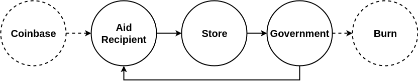

| FATIP | Title                     | Status | Category | Author                            | Created   |
| ----- | ------------------------- | ------ | -------- | --------------------------------- | --------- |
| 201   | Address Workflow Standard | WIP    | Core     | Devon Katz\<<devonk@dbgrow.com>\> | 10-1-2018 |

[TOC]

# Summary

This standard defines a mechanism to classify addresses, and restrict address class interactions. The standard uses a basic graph data structure to model class interaction restrictions.

# Motivation

No previous FATIP standard addresses use cases where restricting who can receive and trade tokens is critical.

 For example, certain securities tokens are illegal to transfer to unaccredited investors. Perhaps you want to ensure that recipients of aid programs cannot easily form black markets by restricting trade between registered addresses. This standard proposes a structure to solve these issues, while providing compatibility with any token system that uses Factoid addresses for trading tokens.

# Specification

This standard defines address classes and class interactions using a simple directed graph data structure. The graph's edges represent address classes, with edges representing directed trade links between classes. 

The spec allows self cycles (e.g. A => B => B => ... => B => C) to denote that classes can trade with themselves, and traditional cycles (e.g. A => B => C => A ) to denote that one or more middlemen must be included in the lifecycle for tokens to return to their original holder.


 In this example we'll be modeling an aid program that restricts the flow of tokens issued by **[Government]** via **[Coinbase]** according to this workflow:

**[Coinbase TX] => [Government] => [Recipient] (Self Cycle) => [Store] => [Government] ...**



This model is meant to simulate a program where the government ("government") issues tokens to aid recipients ("recipients"), aid recipients can trade the token amongst themselves for goods and services, and are allowed to redeem tokens at shops("store") for goods. Shops may only send tokens to the government for redemption & settlement. 

For simplicity, the issuer can issue a coinbase transaction to any address class. In this example, the government issuer submits a coinbase transaction to their accounts to initially distribute funds into the system.

This is just a simple example. It's possible to model nearly any dynamic using this standard.


## Token Issuance Chain

This standard uses the implementing token standard's issuance chain for it's entries.

To be valid and secure, this standard requires FATIP-201 data is signed by the issuing identity(For example, using FATIP-101).

### Initial Valid Token Issuance Entry

The implementing is expected use the standard field name `FATIP201` under the root of it's content JSON. To be valid, the first valid issuance entry in any implementation of this standard must declare an an initial workflow under the aforementioned `FATIP201` field in it's root.


#### Example Initial Valid Issuance Data Structure & Field Summary

```json
"FATIP201": {
    "classes": {
        "government": {},
        "recipient": {
            "balanceLimit": 400
        },
        "store": {},
    },
    "workflows": {
        "government": [
            {
                "class": "recipient"
            }
        ],
        "recipient": [
            {
                "class": "recipient"
            },
            {
                class: "store"
            }
        ],
        "store": [
            {
                "class": "government"
            }
        ]
    },
    "addresses": {
        "FA3aECpw3gEZ7CMQvRNxEtKBGKAos3922oqYLcHQ9NqXHudC6YBM": {
    		"class": "recipient",
            "balanceLimit": 400
		},
        "FA3ZxKyN3HHoJftdGbFp5PRvi12jPvQ3SgGNTDQya2D5jwFrtLqZ": {
    		"class": "store",
            "metadata": {
                "id": "cNF293nf1kll1!v1d2valksldaius"
            }
		}
    }
}
```

| Name                                | Type   | Description                                                  | Validation                                      | Required |
| ----------------------------------- | ------ | ------------------------------------------------------------ | ----------------------------------------------- | -------- |
| `classes`                           | object | The collection of addresses class definitions. These are the nodes of the graph. | At least 1 key must be specified in `classes`   | Y        |
| `classes[<class>]`                  | object | The address class definition                                 |                                                 | Y        |
| `classes[<class>].balanceLimit`     | number | The maximum token balance that can be achieved by addresses belonging to the class. If omitted, no limit is enforced. | Positive nonzero integer                        | N        |
|                                     |        |                                                              |                                                 |          |
| `workflows`                         | object | The collection of address class workflows. These are the directed edges of the graph that define how tokens can move between address classes. | At least 1 key must be specified in `workflows` | Y        |
| `workflows[<class>]`                | array  | The array of directed relationships between `<class>` and `workflows[<class>][n].class` | `classes[<class>]` must exist                   | Y        |
| `workflows[<class>][n].class`       | string | The class able to receive tokens from`<class>`               | `classes[<class>]` must exist                   | Y        |
|                                     |        |                                                              |                                                 |          |
| `addresses`                         | object | The collection of approved addresses                         |                                                 | Y        |
| `addresses[<address>]`              | object | The data describing the approved Factoid address `<address>` | `<address>` must be a valid Factoid address     | Y        |
| `addresses[<address>].class`        | string | The address class `<address>` belongs to                     | `classes[<class>]` must exist                   | Y        |
| `addresses[<address>].balanceLimit` | number | The maximum token balance this address can hold. Overrides `classes[<class>].balanceLimit` on a address by address basis. | positive nonzero integer                        | N        |
| `addresses[<address>].metadata`     | object | Free space for user defined key value pairs.                 | Valid JSON                                      | N        |


#### Reserved `general` and `burn` Classes

Two classes,  `general` and `burn` are reserved for specialized usage by the standard.

##### `general` Class

The `general` class encompasses all Factoid addresses that are not explicitly approved in `addresses`. This allows including the general public in workflow models without having to approve or register large quantities of addresses.

By default the `general` class is omitted from `classes` and `workflows[<class>]`, meaning that tokens may not be traded to non approved addresses. You may override the `general` class in the `classes`  and `workflows` data structure to implement your own rules.


##### `burn` Class

The `burn` class represents the designated burn address for the FAT ecosystem. The 0th Factoid Address: `FA1y5ZGuHSLmf2TqNf6hVMkPiNGyQpQDTFJvDLRkKQaoPo4bmbgu` representing a private key with all zeros.

By default, the `burn` class is omitted from the `workflows` data structure, meaning that holders can not burn tokens. In a workflow, allowing trade from an address class to the `burn` class entitles members of the class to burn tokens.  

You may override the `burn` class in the  and `workflows` data structure to implement your own rules. The `burn` class will be ignored if included in the `classes` data structure, since the burn address cannot send tokens.


### Workflow Update Entry

It's unreasonable to expect a single issuance entry to define all addresses, classes, metadata, and more in a single 10KB entry for a workflow. Entries on the issuance chain following the initial valid issuance entry serve as update entries for modifying address classes, approved addresses, and more. 


A simple update syntax is defined to perform updates, and the same standard `FATIP201` field name is used to contain the update:


#### Example Workflow Update Entry Content & Field Summary

```json
"FATIP201": {
    "update":{
		"$setAddress": {
			"FA3sdfsZxKyN3fn34iufn3i4n29292SgsdfGNTDQya2D5dddj": {
            	"class": "recipient"
            }
     	}
    }
}
```

| Name                                 | Type   | Description                                                  | Validation                                                   | Required |
| ------------------------------------ | ------ | ------------------------------------------------------------ | ------------------------------------------------------------ | -------- |
| `update`                             | object | The update to apply to the workflow implementation           |                                                              | Y        |
| `update[<operator>]`                 | object | The collection of `<operator>` type updates to apply.        | `<operator>` must be a valid operator                        | Y        |
|                                      |        |                                                              |                                                              |          |
| `update["$setAddress"][<address>]`   | object | The object describing the address's class, metadata, etc. Value Equivalent to `addresses[<address>]` | `<address>` must be a valid Factoid address                  | Y        |
| `update["$unsetAddress"][<address>]` | -      | Remove an approved address                                   | `<address>` must be a valid Factoid address. The value of the key must be non null | Y        |
| `update["$setClass"][<class>]`       | object | Update or add an object describing an address class. Value Equivalent to `classes[<class>]` | Equivalent to `classes[<class>]`                             | Y        |
| `update["$setWorkflow"][<class>]`    | array  | Update or add an object describing the workflows belonging to a class. Value Equivalent to `workflows[<class>]` | Equivalent to `workflows[<class>]`                           | Y        |


# Implementation


# Copyright

Copyright and related rights waived via
[CC0](https://creativecommons.org/publicdomain/zero/1.0/).